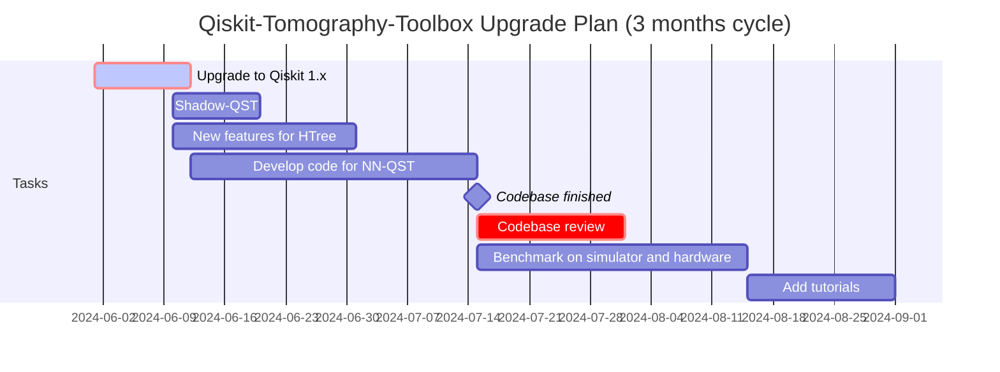

```mermaid
gantt
    dateFormat  YYYY-MM-DD
    title       Qiskit-Tomography-Toolbox Upgrade Plan (3 months cycle)
    %% excludes    weekends
    %% (`excludes` accepts specific dates in YYYY-MM-DD format, days of the week ("sunday") or "weekends", but not the word "weekdays".)

    section Tasks
    Upgrade to Qiskit 1.x          			      :crit, active, task1, 2024-06-01,2024-06-12
    Shadow-QST	  														:      				 task2, 2024-06-10,2024-06-20
    New features for HTree  									:      				 task3, 2024-06-10,2024-07-01
    Develop code for NN-QST										: 				     task4, 2024-06-12,2024-07-15
    Codebase finished                					:milestone,    m1, 2024-07-15, 0d
    Codebase review														:crit,    		 task5, 2024-07-15,2024-08-01
    Benchmark on simulator and hardware			  :         		 task6, 2024-07-15,2024-08-15
    Add tutorials                 						:						   task7, 2024-08-15,2024-09-01
```

